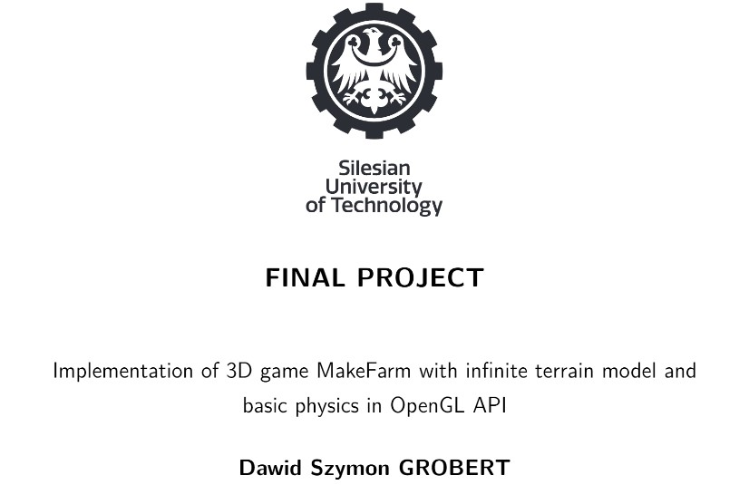

Implementation of 3D game similar to Minecraft with infinite terrain model and basic physics in OpenGL API. The game was created as a final project of studies in computer science at the Silesian University of Technology. The game has been named as Pre-MakeFarm, as its development continues on a separate repository.
> This game uses no engine!

A <a href="https://www.youtube.com/watch?v=_NRlEcWvK3k">video</a> showing how the game works

### Features
* Main menu.
* Loading a previously saved game world.
* Generation of a new game world.
* Infinite game terrain.
* The possibility of pausing the game.
* Basic physics.
* Various biomes (varied terrain).
* Equipment.
* Crafting.
* Health bar.
* Hotbar (quick access bar).
* Oxygen bar.
* Destroying and placing blocks.
* Swimming.

### Used Libraries
* **FastNoise Lite** - A noise generation library focused on high performance and a wide range of noise algorithms.
* **GLEW** - A library that allows checking at runtime which extensions are present and which function can be used. It provides OpenGL functions as well as OpenGL extensions.
* **GLM** - It is a mathematical library based on the OpenGL Shading Language (GLSL). It contains a collection of classes and functions useful for creating vectors or matrices for OpenGL applications.
* **Dear ImGui** - A library for creating a user graphical interface. It is very often used for tool development, or for debugging purposes. 
* **ImGui-SFML** - A library that allows to easily combine the *SFML* library with the *Dear ImGui* library.
* **Serializer** - It is a serialization framework that allows saving the objects directly to files in binary format.
* **SFML** - It is a fast and simple cross-platform library that allows easy access to windows, graphics, audio, or network
* **TGui** - This is the GUI library that is used to draw user interface in-game such as buttons, or sliders.
* **GoogleTest** - It is allows writing tests, and mock classes.

### Technologies and tools
* **CMake** --- A multi-platform tool that allows to automatically manage of the compilation process.
* **C++20** --- C++ standard to be released in December 2020.
* **MSVC Compiler 14.34.31933** --- A compiler developed by Microsoft.
* **CLion 2022.2** --- JetBrains' multi-platform integrated development environment for C/C++ languages.
* **Clang-Format** --- C++ code formatter to ensure a stylistically consistent code style and format.
* **Git** --- A distributed version control system for tracking code changes.
* **Github** --- A web hosting service that allows hosting development projects using the Git version control system.

### How to install and play
Please see the [external documentation](readme/external.pdf).

<h2>The report</h2>

You may find the final report <a href="readme/final_report.pdf">here</a>

